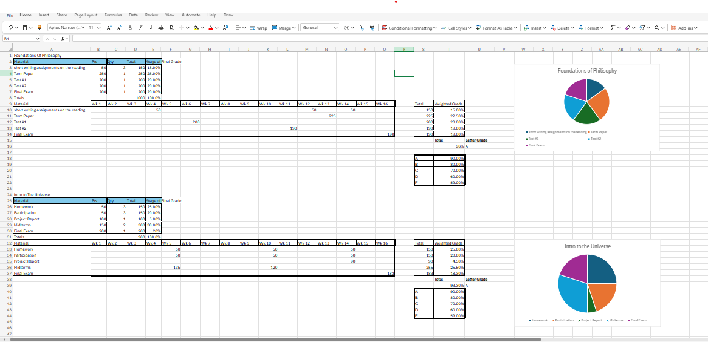
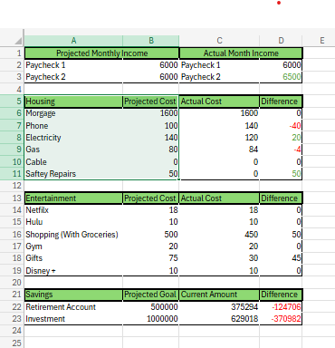
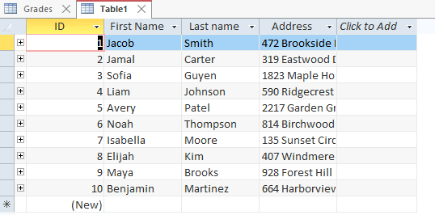
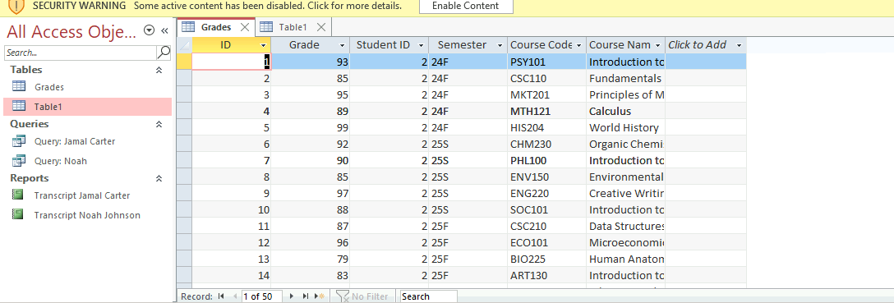
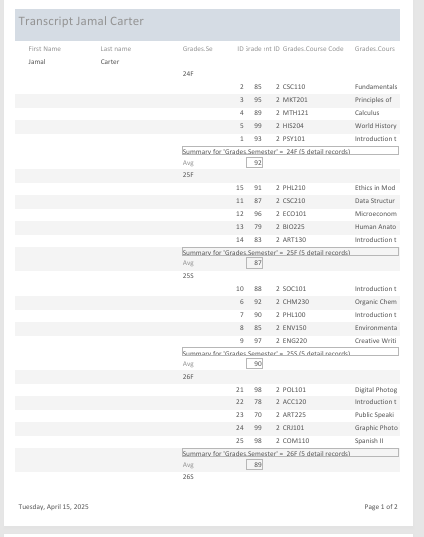

# Gabe Czarnecki
Contact Info: [fill in]
### About Me 
Hello! I am an experienced para-professional Police Officer and Data Analyst professional with 1 year of proven expertise in Microsoft 365 and Data gathering. 

With skills in Excel Spreadsheet Shortcuts, Personnel management, processing large amounts of data, programming, and Problem Solving, I am able to efficiently analyze data and achieve accurate documentation. I am adept at using Jdoodle, Excel, and MS Access. 

My Proficient skill set, commitment to being detail-oriented, and passion for learning make me a valuable asset.  In my spare time, I like to Work out and run in the mornings. 

### Education 
 - Loyola University - 1 year
 - Notre Dame HighSchool - 4 years/highschool diploma

### Projects

#### Grade Calculator on Excel
 **Summary**: I was given the task to create a Grade calculator for two different classes using Excel and its equation shortcuts. 

**Initial project idea:**  My professor assigned this project to me as one of the last homework assignments in our unit on Excel spreadsheets. The problem we set out to solve was to create a calculator that, if we input all the grades from a class in a semester, the output would give us the Letter and percentage of our final grade. This problem had to be solved because it proved useful for any class we took to calculate the final grade. 

Tools I used: 
The Tools that I used to get this done were Microsoft Excel and Moodle for all my assignments. 

Challenges I faced:
Some challenges I faced were creating the shortcuts to calculate the final weighted grade percentage from all the inputed assignments. To overcome this, I referred back to the reference project we had and took note of what the shortcuts were there 

Other Resources: 
For some of the equations, I referred to YouTube videos on other people making grade calculators 

Result:
I set out to achieve a grade calculator, and I did achieve it. If I were to make any improvements, it would just be to tidy up the look of the spreadsheet to make it look neater 

#### Budget Tracker
 Summary: I set out to create a budget tracker that would include my income, projected and actual costs from different payments and expenditures in my budget.

Initial project idea: 
I was given the task by my Professor at the start of the year to create a budget tracker. The goal of this assignment was to build a tracker for our finances. For this tracker, I would use the projected and actual costs of things to calculate the difference and truly track my budget. Some requirements for this tracker would be to include our income, current savings, savings goals, and any expenses we might have. This assignment had to be done because it would help us currently and in the future track our budgets. 

Tools I used: 
Microsoft Excel was used to create this. 

Challenges I faced:
Some challenges I faced during this were finding out what different aspects of my budget currently were. For example, I do not pay the mortgage or any expenditures associated with the house, so I had to rely on my parents. 

Other Resources: 
To find out how much certain expenditures were, like Netflix or Hulu, I used Google to look them up. 

Result:
I achieved my initial goal of creating a budget tracker. If I could change anything in the future, it would be to add everything from my personal budget, so it would prove to be more useful to me. 

#### Transcripts through Access
Through Microsoft Access, I created transcripts for 2 students and split them into 50 different classes that included what grade they received in the class. 

Initial project idea: 
This assignment was my last assignment given to me before my final project. For this homework, we used Microsoft Access through the Apporto virtual desktop. Within Access, we were to create 10 random students, and we would pick two of them to give them classes. One student would have completed 3 years and the other 4, with 5 classes per semester and 2 semesters a year. Then, using the Access function, we would have to create transcripts for both of the students and submit those PDFs. 

Tools I used: 
Microsoft Access and Apporto Virtual Desktop 

Challenges I faced:
A challenge I had was submitting the homework due to all my work being on a virtual desktop, and I couldn't transfer the PDF to my computer desktop. To submit this homework, my solution was through the virtual desktop, I would have to log into my Google account, and from there, I could reach Moodle to submit the assignment. 

Other Resources: 
To guide me with the project, I used the pre-recorded lectures my professor had posted. I also used AI to generate the random names and addresses. 

Result:
I was able to achieve my goal of creating a transcript with the help of Microsoft Access. If I could change anything, I would use Access on the desktop of my computer instead of a virtual desktop so that it would be easier to submit the assignment.